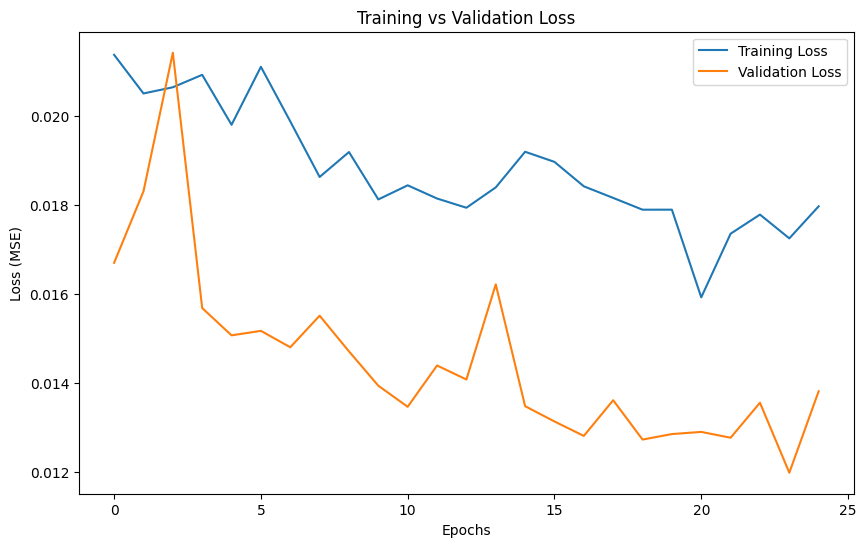

# Netflix Stock Price Prediction using LSTM

## 📖 Overview

This project uses a Long Short-Term Memory (LSTM) neural network to predict the stock price of Netflix (`$NFLX`). LSTMs are well-suited for time-series forecasting because they can remember patterns over long sequences of data.

The model is built using TensorFlow/Keras and trained on historical stock data from the `NFLX.csv` file.


---

## 📊 Dataset

The dataset used is `NFLX.csv`, which contains historical daily stock market data for Netflix Inc. It includes features such as:
* **Date**
* **Open**
* **High**
* **Low**
* **Close**
* **Volume**

---

## 🚀 Getting Started

Follow these instructions to get a copy of the project up and running on your local machine.

### **Prerequisites**

* Python 3.8+
* pip (Python package installer)

### **Installation**

1.  **Clone the repository:**
    ```sh
    git clone <your-repository-url>
    cd <your-repository-name>
    ```

2.  **Install the required packages:**
    ```sh
    pip install -r requirements.txt
    ```

---

## 📈 Usage

To run the project and see the model training process, open and run the Jupyter Notebook:

```sh
jupyter notebook notebook.ipynb
```

The notebook contains all the steps, from data loading and preprocessing to model building, training, and evaluation.

---

## 🧠 Model Performance

The model was trained for 25 epochs. The training and validation loss curves show that the model generalizes well to the unseen data and does not exhibit signs of overfitting.



*(This assumes you will add the loss graph image to your GitHub repository with this file name)*